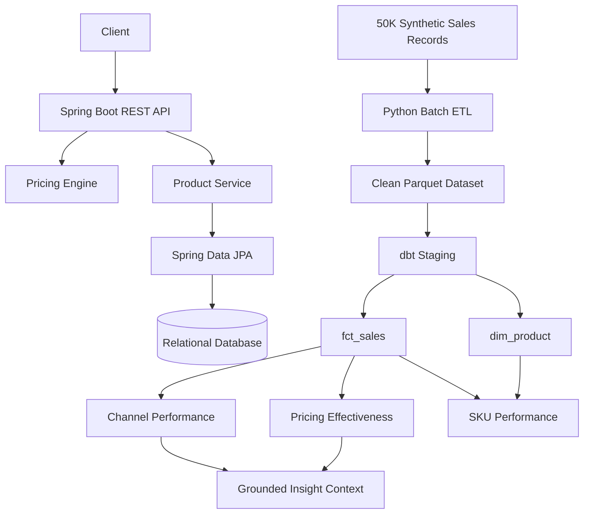

# Retail Pricing Intelligence Platform

An end-to-end engineering project combining a Java/Spring Boot
transactional backend with a Python/dbt analytics pipeline for
multi-channel retail pricing.

The project was designed to explore how pricing decisions can move
from operational APIs into reproducible analytical models and
business-facing insights.

## Architecture

## Backend
The backend uses Java and Spring Boot to expose pricing and product
REST APIs.
Key concepts demonstrated:
- REST API design
- Spring dependency injection
- Controller / Service / Repository layering
- JPA and Hibernate
- JDBC fundamentals
- Repository Pattern
- PostgreSQL-ready configuration
- Spring Profiles
- Bean validation
- Global exception handling
- Transactions
- JUnit and MockMvc testing
## Analytics Pipeline
A reproducible synthetic retail dataset contains approximately
50,000 multi-channel sales records.
The Python pipeline performs:
- schema validation
- duplicate handling
- business-rule validation
- revenue and margin calculations
- Parquet output
dbt transforms the processed dataset into:
- stg_sales
- fct_sales
- dim_product
- mart_channel_performance
- mart_sku_performance
- mart_pricing_effectiveness
Automated dbt tests validate uniqueness, nullability,
accepted values and relationships.
## Data Model
The grain of fct_sales is one sales transaction.
fct_sales stores measurable business events such as units sold,
revenue, gross profit and margin.
dim_product contains descriptive product attributes.
This separates transactional facts from reusable dimensions and
supports business-facing analytical marts.
## AI-ready Insight Layer
The language-generation layer is deliberately separated from
numerical calculations.
SQL and dbt generate validated metrics first. These metrics are then
converted into a structured JSON context that can be passed to an
LLM for explanation.
The LLM is therefore responsible for language generation rather than
calculating financial metrics.
## Engineering Decisions
The project originally used raw JDBC repositories before introducing
Spring Data JPA. This made the trade-off between explicit SQL control
and ORM productivity visible.
Channel pricing logic was consolidated into a single source of truth
after an early design introduced duplicated channel rules.
H2 is used for lightweight local development and automated tests,
while PostgreSQL configuration is provided through a Spring profile.
Raw CSV data is transformed into Parquet because columnar storage is
better suited to analytical workloads.
dbt separates staging, reusable analytical models and business marts
to prevent duplicated transformation logic.
## Testing
Backend:
./mvnw clean test

Analytics:
cd analytics
python scripts/generate_sales_data.py
python scripts/run_etl.py

cd dbt
dbt run --profiles-dir .
dbt test --profiles-dir .

## Technology
Java · Spring Boot · Maven · REST · JPA · Hibernate · JDBC · SQL ·
PostgreSQL · H2 · Python · DuckDB · Parquet · dbt · Git · GitHub
Actions · Docker Compose
## Scope
This is a portfolio engineering project using synthetic retail data.
The focus is architectural decisions, backend fundamentals,
data-engineering workflows and automated testing rather than
production-scale infrastructure.